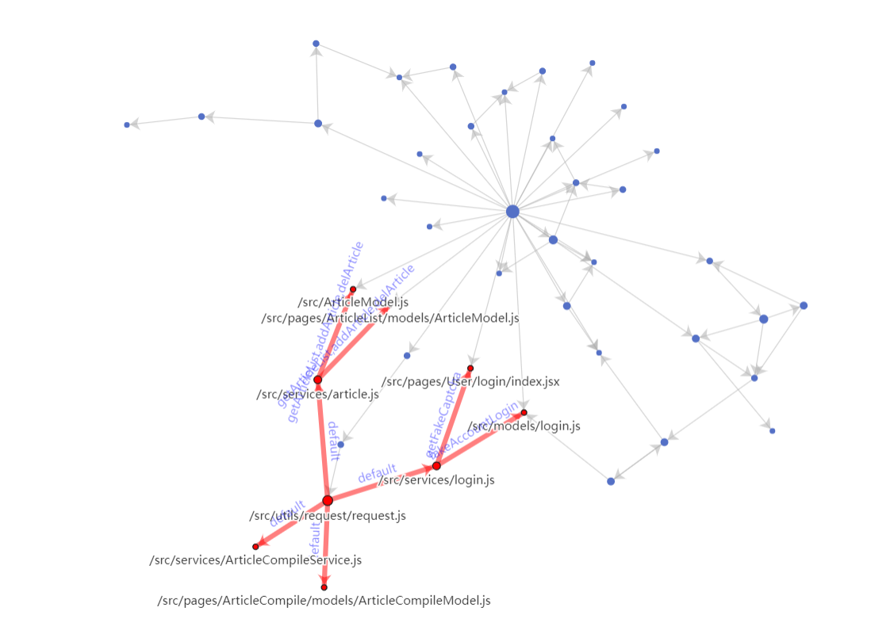

# CDAAVT
Component dependency analysis and visualization tool.
## 下载
```
npm install cdaavt --save
```
## 使用
相关指令如下：
| 指令                                      | 说明                                   |
| ----------------------------------------- | -------------------------------------- |
| `cdaavt -v \| --version`                  | 查看版本                               |
| `cdaavt -h \| --help`                     | 查看详细说明                           |
| `cdaavt -r \| --run`                      | 运行cdaavt工具，分析结果在控制台打印   |
| `cdaavt -o <output> \| --output <output>` | 指定分析结果的输出文件名output         |
| `cdaavt -f <format> \| --format <format>` | 指定分析结果的展示形式，包括json和html |
| `cdaavt -p <path> \| --path <path>`       | 对指定path的影响范围进行分析           |

将指令加入`package.json`文件的`scripts`字段中    

## 可视化效果：
